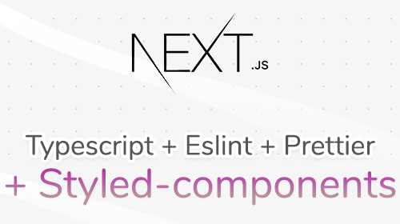

<h1 align="center">
  
</h1>

## 💻 NextJS - Setup Inicial

<h1 align="center">
    <a href="https://nextjs.org/">🔗 NextJs</a>
</h1>

Siga as instruções disponabilizadas no link abaixo: 

<a href='https://www.notion.so/NextJS-Setup-Inicial-035ea767eecd40a493c4464e860c7ffa'>Clique aqui</a>

